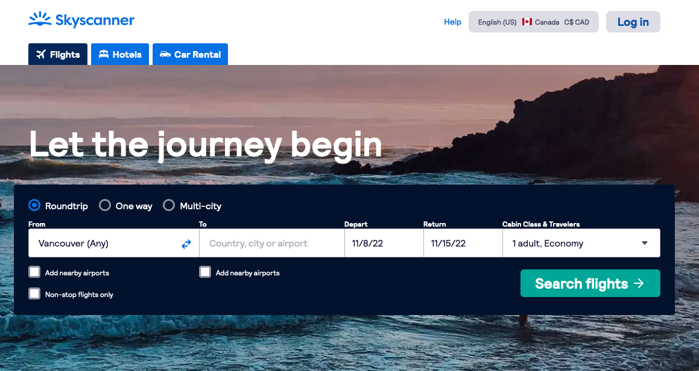
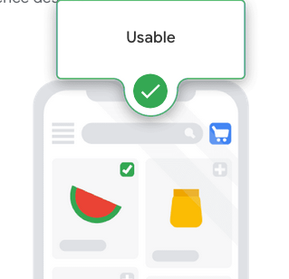
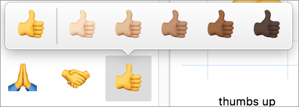
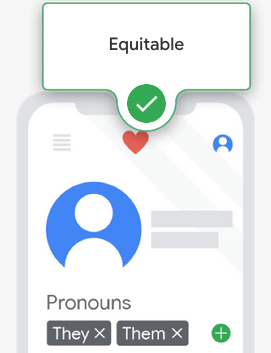
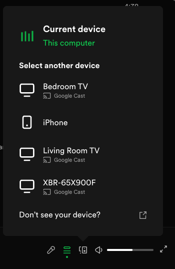

# Introducing User Experience Design

## Who are UX Designers?

They tend to have various backgrounds or knowledges before they became an UX Designer. 
For example..
  * an artist without a formal design education
  * a technology professional with a curiosity to learn about the magic of UX design
  * etc..

## What is User Experience?
- User Experience : How a person **feels** about *interacting with* *or experiencing* a product.
- Product : A good, service, or feature
  - Video Game controller, potato chip, smart phone, new "Buy" button 

## Four aspects of User Experience we care about
- **Usable** - Improve usability
  - The Design, structure and the purpose of the product should be clear and easy to use, for any people. 
    * Is everything in the design easy to find?
    * Is the design's functionality easy to understand?
    * Can users accomplish specific tasks within the design?

  |||
  |---|---|
  |the Skyscanner's index page shows searching box as a first component since the main reason of the product is to search flight schedules|Users can navigate to the cart in the middle of anything, at anytime|

- **Equitable**
  - Helpful to people with diverse abilities and backgrounds. 
  - High-quality experience should be delivered to all users regardless of background, gender, race, or ability.

  

- **Enjoyable**
  - Create positive connection between the users and the products. Taking users' thought and feeling into a count. **It's all about feeling, sympathy**
  - Research comes in to solve this. Ask users, survey, analysis. 
  * Are there aspects of the design that consider the user’s feelings and their thoughts?
  * Does the design inspire delight in the user?
  * Does the design keep the user engaged throughout their experience and make them excited to keep using the product?
  
   
  (Spotify supports Multi Device Switch feature which allows you to control Spotify app with any device you are connected with)

- **Useful**
  - Solve user problems. What if the map suddenly doesn't work if you are lost?
  - But **useful** and **usable** are not the same. 
    - Usability refers to the product *working well* and *being easy to use*.
    - Usefulness refers directly to the ability to *solve user problems*.

## What UX Designers do?

Focus on the **experience that users have** while using products like websites, apps, and physical objects. And the end goal is to make those everyday <ins>interactions useful, enjoyable, and accessible</ins>.

UX Designers usually have a good sense of visuals. Images or any visual components. But it is not that necessary. Visual aspect is only a small aspect of UX.

Besides, UX Designers are more curious about people, how they think, and how to make the product easier to use.

## Various UX Designer roles 

* Interaction Designers - Focus on designing the *experience* of a product and how *it functions*.
  * The Goal : Make the product easy to navigate and simple for users to interact with.
    

      
You would ask yourself...

      >"What should happen if a user taps on this button?" 
      "How do we make this action easier for users to complete?" 
      "How are the design elements within the website laid out?"
    
 

* Visual Designers - How *a product or technology looks*. Logos, illustrations, icons, font color, size or placement of visual elements. They focus on the layout of each page or screen and make all of the design elements fit together in a visually appealing way.
  * The Goal : To delight users with designs that inspire, engage, and excite them.
    

      
You would ask yourself...

      >"What kind of visual style should icons have, in order to fit the product's branding?" 
    "Which color and font should we use for this button?" 
    "How are the design elements within the website laid out?"
    
 

* Motion designers - What it feels like for *a user to walk through a product* and how to *create smooth transitions between pages* on an app or website.
  * The Goal : Design elements that move, rather than traditional static designs.
    

      
You would ask yourself...

      >"How should an app transition between pages?" 
    "How do we show the connection between these actions?" 
    "What’s an engaging animation that will help tell our story?"
    
 

  

  
You would work with those people...

  * UX Researchers - Conduct studies or interviews that examine how people use a product. They will try identifying pain points of while using the product and explore how products can help solve those problems.

  * UX Writer - How to make the language within a product clearer so that the user experience is more intuitive. Also help on defining a brand's voice and personality, tone of language or labels for buttons.

  * UX Engineer - Translate the design's intent into a functioning experience. Help UX Design teams to figure out if designs are intuitive and technically feasible. UX Engineers synthesize design and development, bringing product concepts to life. 
  
 

## Product development life cycle

(The success of each stage depends on the previous stage's completion)

1. Brainstorm
  - For a target goal, *explore problems, ideas, feedbacks* by doing user surveys and check the competitors. 
   => It will help determine what problems need to be addressed by the product's design.

2. Define
  - *Narrow down the brainstormed resources* into *the specifications of the product*. Making a **scope** of the product.
    - Who is the product for?
    - What will the product do?
    - What features need to be included for the product to be successful?

    The product cannot solve every user problem. It should focus on a specific problem to solve, not solving all existing problems.

    And defining scope will guide the following process to be goal-oriented and focused.

3. Design  <- The stage that UX designers are most engaged
  - Drawing wireframes (outlines or sketches of the product)
  - Creating prototypes (early model of a product that convey its functionality)

4. Test
  - Work with engineers to develop functional prototypes that match the original designs, bring it into a real life. 

    Includes three stage of testing
    - Internal testing
    - Stakeholder testing : Who will make decisions about the product.
    - External testing with potential users (or beta testing)

5. Launch

## Job Responsibility of Entry-level UX Designers

1. Researching - Understand the people who use our product
    * Backgrounds, demographics, motivations, **pain points**, emotions, and goals.
    * By surveys, observations, and interviews.

2. Wireframing - Basic outline or sketch of a product, or a screen like an app or website
    * Create *wires* with lines and shapes, with some text.
    * Can be drawn by hand or digitally, *bringing the design ideas to life*.

3. Prototyping - Early model of a product that demonstrates its functionality.
    * Tend to make multiple prototypes for any given product throughout the design process.
    * Prototype's scale can vary
      * Could be made to demonstrate one specific feature of a product.
      * ex) transition between screens
      * ex) the way the product physically looks and feels

4. Create Information Architecture (or IA) - Decide how our product is *organized and structured*
    * A **skeleton** that outlines how users interact with our product. 

5. Visual Design - How the product or technology looks

6. Communicate Effectively with other team members

## Growth of UX Designers in their career

* Specialist - Expert at one thing

* Generalist - Broad number of responsibility by wearing many hats

* *T-Shaped Designer - Export at one thing and capable of wearing many hats <- This is what you would be as an experienced UX Designer!!

## To complete the course...

* Must complete a portfolio that showcases 3 major UXD projects and 3 case studies

## Discussions

- What is your experties? What is your background?
  

  
Answer

  C++ Native Application Developer
  
 

- If you are an UX Expert in the company, which role you would be?
  

  
Answer

  I would work as a T-Shaped UX Designer that delivers UX Designs with an strong engineering aspect and prototyping skills.

  > Engineers translate designs into a functioning experience, like an app or a website. They help UX teams figure out if designs are feasible from a technical standpoint and bring that idea to life. Working closely with engineers and involving them early in the design process is critical to ensure your project is set up for success. 
  
 

- Have you noticed any designs that make you feel a strong response?
  

  
Answer

  Tumbler. When you put the lid on, locking direction (clockwise) and closing direction are the same so that you don't make a mistake of spill.
  
 

- What skills do you already have that can help you on your journey to becoming a UX designer? For example, are you artistic, detail-oriented, or considerate? Do you have relevant past experience in the world of design? Share your passion.
  

  
Answer

  I'm a detail-oriented Software Engineer. By concerning UI Layouts & Technical problems at the same time, I'm able to make efficient decisions in both ways of Technical aspects and UX. 
  
 

- What are your goals for exploring the field of UX Design? and why do you want to pursue this professional certificate?
  

  
Answer

  I'd like to understand broad idea about UX design and how the design process goes. And then want to mix the new knowledges into my Software Engineering for a better, delightful product
  
 

## Helpful Resources

[Interaction Dessign Foundation](https://www.interaction-design.org/literature) 
[Adobe XD Ideas](https://xd.adobe.com/ideas/) 
[UX Collective Medium](https://uxdesign.cc/) 
[Nielsen Normal Group](https://www.nngroup.com/articles/) 
[What is good design?](https://design.google/library/good-design/)