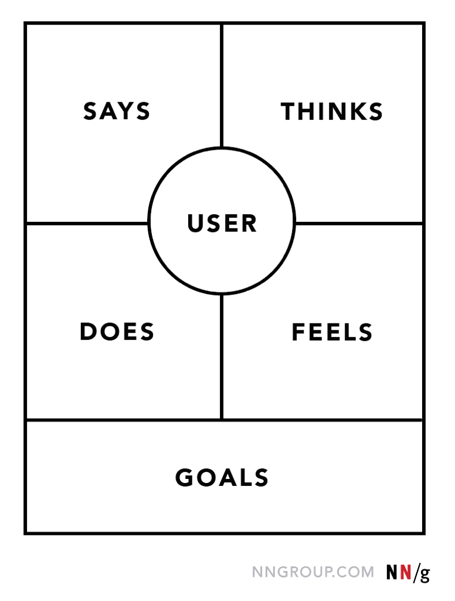

# CRS2-01. Empathizing with users and defining pain points

The idea challenge I picked for the rest of the courses.

Sharpen result : Design a mobile sales app for a photographer

## 1. Empathizing user experiences

Empathy : The ability to understand someone else's feelings or thoughts in a situation.

Empathy and Sympathy are different.

Sympathy is the experience of showing concern or compassion without feelling the emiltions themselves. Meanwhile, you share their feelling, feel their thoughts in your heart, it is called Empathy.

## 2. How can you talk to them directly? How do you recruit participants to prepare interview?

Screener Survey
   > A detailed list of questions that helps researchers determine if potential participants meet the requirements of the research study

You have to determine the interview goals based on...

1. What do you want to learn from the interviews?
2. Are there certain user problems or pain points that you need to empathize with?
3. Are there any characteristics of users you want to interview?
4. Why?
5. How much information should we have to ensure we get a comprehensive and balanced set of data?

Examples will be like this.

- I want to understand the processes and emotions that people experience around the problem my product is trying to solve.

- I want to identify common user behaviors and experiences with tasks that my product is trying to address.

- I want to understand user needs and frustrations as they relate to the product I’m designing.

Once you made up your mind of the goal, then it's time to prepare interview questions.

- Ask open-ended questions
    Simple "yes" or "no" cannot give you enough insights of the problem. But those questions should not lead or pressure participants towards a desired response.

- Keep questions simple and short
    If they get complicated, it will misdirect the core reason of the question.

- Ask follow-up questions
    During the empathize phase of the design process, interviews should be conversational, so encouraging participants to elaborate is a best practice. Try asking them "Why" or "Tell me more about that" to keep the conversation flowing.

Once you are prepared with the goals and questions for the interview, then you should aim to form `Representative sample`
> A subset of the target population that seeks to accurately relfect the characteristics of the larger group

Finding participants can be depends on where you find them.

You can start from who you know.

- Family members, Friends, Current or former colleagues, Managers

Then find outside of your circle

- Professional networking websites, Online groups based on personal interest

You even could get some help from

- Third-party Agency

## 3. Conducting a User Interview

1. Meet the participant
    - Build a good rapport
    - Thank the participant for coming
    - Review legal details
    - Gather basic details
    - Let participant know there are not right or wrong answers

2. Conduct the interview

3. Take notes
    - Highlight compelling quotes
    - Document observations about participants
    - Consider recording interviews

4. Wrap up the interview
    - Show the gratitude for their time
    - Let them feel their contribution has been really good
    - Give users a chance to share any final thoughts

## [Exercise] Prepare Participants interview

1) Determine research goals

    - I want to understand how the photograph service works are done and how they schedule, contact with customers.
    - I'd like to figure out their pain point of connecting users and payment for services.

    or

    - I'd like to find how the people use the professional photograph services and what they think about it
    - I want to understand what helps those people get the best and satisfying result.

2) Define your target audience

   - Professional photographers
   - People who like to get some photo services.

   - Around Local area
   - Age : 10 ~ 40 Years old
   - People who are new couples, preparing marriage, or preparing family event that needs professional photograph services.

3) Write interview Questions

   - Can you describe how do you find your customers and how do you contact with them?
   - How do you manage the payments of your service? are there any troubles to get paid?
   - How do you show your reviews from the customers and how do you show that to the other potential customers?

    or

    - Can you describe any experience of using photograph services you used?
    - Was it easy to get it done and also paying them?

- Selected bios from [Virtual bios](https://docs.google.com/document/d/1_G6ZuLixniw2vbwo7Qi1LLhpj4g2Ah_KSNDK1wY4LQA/template/preview?resourcekey=0-F9RhhH0XdA6so0Yyj1e4iA)

### Empathy exercise

```txt
Zareen
Age: 22
Education: 4th year university student
Hometown: Bruges, Belgium
Family: 2 sisters
Occupation: Project management intern for a large international firm
Zareen is about to complete a B.A. in Business Administration and hopes an internship will launch her career in project management. Even though Zareen most enjoys the time spent working with her mentor on a campaign, she also enjoys doing other tasks like getting coffee and food for the office. She feels these tasks are a good opportunity to network and to demonstrate being a team player with keen attention to detail.

Zareen would like to demonstrate her commitment on the job, complete everyday tasks efficiently, and eventually be trusted with increased responsibilities in the office.


- Can you describe any experience of using photograph services you used?
     "I had once when my younger sister graduated. My family didn't like the result of my graduation ceremony picture, so we looked up for a professional service. The result was pretty good but asking them for revisions or trusting their work was a bit harsh. And finding photograph services was not easy as well."

- Was it easy to get it done and also paying them?
    "They did a good job on making the result as best as they can. But since they wanted to get paid in cash, it wasn't comfortable to pay extra when they wanted. Because I felt it is not professional enough"
```

```txt
Neelam
Age: 35
Education: Master’s degree in Education
Hometown: Champagne, Illinois
Family: Married with one young child
Occupation: Teacher

Neelam is an established education professional with 10 years of teaching experience. She is passionate about her job but sometimes has trouble managing the stress of teaching while also raising a young child. Neelam also prepares breakfast and dinner for the family on most days, sometimes leaving her with little time to grade papers and plan syllabi.

Neelam appreciates products that help her stay more organized and manage her time in the classroom and at home.

- Can you describe any experience of using photograph services you used?
     "My first experience was for my marriage and another was when my daughter turned 3 years old. Both were pleasant and I was happy with both results"

- Was it easy to get it done and also paying them?
    "I used their website to book an appoinment and consult any regarding decision I had to make. But paid in check. It wasn't that bad but I had to google a lot and search about the reviews"

```

```txt
Carlos
Age: 50
Education: High school and some college
Hometown: New York City, New York
Family: Married with two college-aged children
Occupation: Small business owner

Carlos is a small business owner operating in the middle of a busy metropolitan area. Although competition is tough, sales have been steadily increasing over the last few years. As the business grows, Carlos will need a way to better manage inventory, business administration and marketing efforts. Additionally, customers have been asking for a way to more easily place orders.

- Can you describe any experience of using photograph services you used?
     "I only used once when my older boy graduated the high school. It was not that happy and result was very far from what I expected. I asked them for a partial refund as they mentioned in policy but there was no rule I can use to defence myself. Eventually I only got 30% back, in cash."

- Was it easy to get it done and also paying them?
    "Not really easy. They are professionals but not me. So I trusted their work and decisions but I was too old to internet search everything about how to handle those kind of problems. And partially paid, paying in cash, etc. were very painful to get it done"
```

```txt
Joseph
Age: 20
Education: Enrolled in online college classes
Hometown: Nairobi, Kenya
Family: Lives with their mother, father and one younger sibling
Occupation: Full time student

Joseph is a recent immigrant to the United States who is enrolled in online college classes and is also taking classes at a night school for learning English. He can read English well, but sometimes
encounters difficulties at restaurants or while out running errands, where shopkeepers tend to speak very quickly and limited translation options are available. Joseph is passionate about sports and the outdoors, and wants to explore what his neighborhood has to offer.

Joseph’s priority is balancing his studies with fun, while also having time to look after his younger sibling when his parents are at work.


- Can you describe any experience of using photograph services you used?
    "I personally never used any of those services but I think it's very nice to have a well-organized photography service app that customers can look up for and buy. Then photographers can also show off and promote their works to gather more interest and eventually they don't have to struggle with finding extra connections"
```

### Organize my data

- Users usually find it is hard to cooperate with photographers to get what they want.
- Users are struggling to find proper options in the market.
- Payment systems are vary depends on service providers because there are no specific systems or platforms. And especially, if there is extra charges or some extra actions should take, it gets complicated.

### How would I solve user problems?

- The app can provide showcases of photographers and categorize them as their experties. It will help them to figure out perfect fits.
- The app can provide consolidated or well-established payment system such as Stripe. And when they are mentioning about the payment and the service details, it can be promoted and well described before customers decide to buy.

## 4. Empathy map

: An easily-understood chart that explains everything designers have learend about a type of user

>Visualizing user attitudes and behaviors in an empathy map helps UX teams align on a deep understanding of end users. The mapping process also reveals any holes in existing user data. - from NNG



Aggregated empathy maps (or multiple user empathy maps) : Represent a visualization of everything designers know about an entire user segment or group of similar users. It is more like putting each maps' section into one map.

And depends on the stance of user group answers, you should make different set of aggregate map. For example, no complain or no issues should be a one of aggregate map. If they have some complaints, they also should be a separate aggregate map.

## 5. Personas

: Fictional users whose goals and characteristics represent the needs of a larger group of users

[Benefits of personas]
- 


## Resources

[The Power of Empathy - Dr Brené Brown on empathy vs sympathy (2013)](https://www.dailymotion.com/video/x28nj7a)

[Nielsen Normal Group](https://www.nngroup.com/articles/empathy-mapping/)

About pain points

[Google Font redesign](https://design.google/library/reimagining-google-fonts/)

[Simplify Google Maps](https://design.google/library/exploring-color-google-maps/)

[Airbnb revamped their product design](https://airbnb.design/designing-for-a-changing-world/)

Personas

[Interaction Design Org - Personas - A simple introduction](https://www.interaction-design.org/literature/article/personas-why-and-how-you-should-use-them)

[xtensio - User Persona Template](https://xtensio.com/user-persona-template/)

[Justinmind - User Persona Template](https://www.justinmind.com/blog/user-persona-templates/)