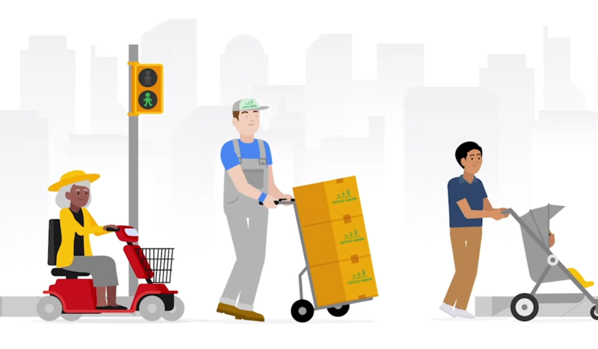

# Creating user stories and user journey maps

## 1. User Story

: A fictional one-sentence story told from the persona's point of view to inspire and inform design decisions.

By doing User Stories, we can get

- Priotize design goals. If we have a lot of user needs to consider, user stories help determine which ones are the most critical to resolve.
- Unite the team.
- Inspire empathetic design decisions.
- Personalize pitches to stakeholders.

Follow this format to answer =>

As a <u>type of user</u>, I want to <u>action</u>, so that <u>benefit</u>.

- Type of user is `Who` we are designing for
- Action is `What` the user hopes will happen
- Benefit is `Why` the user wants the action to happen

### Happy Path

: A user story with a happy ending

### Edge case

: A rare situation or unexpect4ed problem that interrupts a standard user experience

### Spotting and resolving edge cases

1. Create personas and user stories
2. Thoroughly review the project before launch
3. Use wireframe

You want to be able to anticipate what needs they might have, whether they're on the happy path or not.

## 2. User Journey

: The series of experiences a user has as they achieve a specific goal

It's more like building a comprehensive scenarios of personas.

It helps

- Helps UX designers create obstacle-free paths for users.
- Reduces impact of designer bias
  - Focus on specific personas, not you.
- Highlights new pain points
- Identifies improvement opportunities

## 3. Consider accessibility during user research

Accessibility is not just designing to include a group of users with varying abilities.
Instead, it extends to anyone who is experiencing a permanent, temporary, or situational disability.

We don't want to put anyone behind, which means we want to consider all users' journeys, keeping their permanent, temporary, or situational disabilties in mind.

Addressing possible problems of all situations is very important.

### Touch

How would you design for users who have use of one arm, either permanently(One arm), temporarily(Arm injury), or situationally(New Parent)?

- Decide where to place buttons within your design based on several different hand sizes.
- Create a feature that allows double taps to avoid accidental icon clicks.
- Enable the one-handed keyboard feature and general keyboard compatibility.
- Allow button customization for easy access to information that the user finds most important.

### See

How would you design for users who have limited vision, either permanently(Blind), temporariliy(Wears glasses), or situationally(Distracted driver)?

- Use a larger font to create a reader-friendly design of the app.
- Ensure the app and the images have alternate text that can be read by a screen reader.
- Detect the app with high constrast colors.
- Detect whether the user is operating a motor vehicle.
- Don't rely on **text color to explain navigation or next steps**. For example, don't use red text alone as an indicator of a warning. Instead, your design should include explicit instructions.

### Hear

How would you design for users who have limited hearing, either permanently(Deaf), temporarily(Ear infection), or situationally(Loud bar Bartender)?

- Don't rely solely on sounds to provide app updates, like a new message notification. Instead, enable haptics, which are vibrations that engage a user's sense of touch, and notification lights.
- Apply closed captioning to all videos.
- Provide a text messageing system within the app to allow users to communicate through writing.

### Speak

How would you design for users who cannot speak, either permanently(Nonverbal), temporarily(Laryngitis), or situationally(Non-native speaker)?

- Provide written intros, descriptions, and instructions for users, in addtion to video-based content.
- Provide Read-Time Texting during phone calls with users or with app support.
- Arrange alternatives for automated systems that rely on speech recognition.
- Provide an in-app messaging system that allows the use of emojis and image uploads.

## 4. Curb Cut

: The slope of the sidewalk that creates a ramp with the adjoining street

### Curb-Cut Effect

: A phenomenon that describes how products and policies designed for people with disabilities often **end up helping everyone**

## Resources

Assistive technologies

[Disability Technology from TEDx](https://www.youtube.com/watch?v=eFkhFxJZvho)

[How the Blind Use Technology to See The World from TEDx Talks](https://www.youtube.com/watch?v=0EQOZRIA-nA)

[Smartphone accessibility: a comprehensive guide from Uswitch](https://www.uswitch.com/mobiles/guides/smartphone-accessibility/)

[Google’s accessibility information hub homepage](https://www.google.com/accessibility/)

Putting inclusive design into practice

[12 Ways to Design for Everyone from Shopify](https://www.shopify.com/partners/blog/inclusive-design)

[An Accessible Process for inclusive Design from Google I/O](https://www.youtube.com/watch?v=TAzkrXTGEOM)

[6 Principles for Inclusive Design from UX Planet](https://uxplanet.org/6-principles-for-inclusive-design-3e9867f7f63e) 