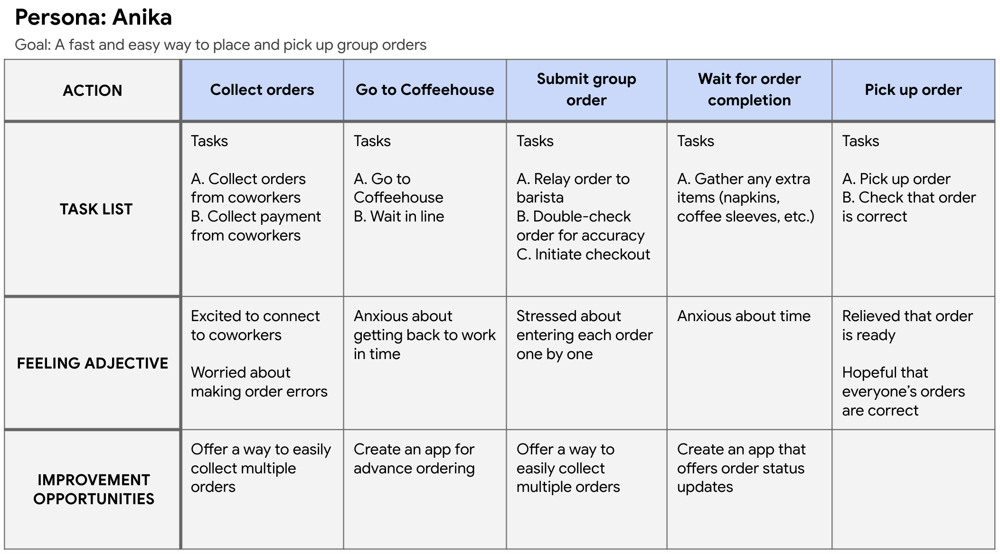
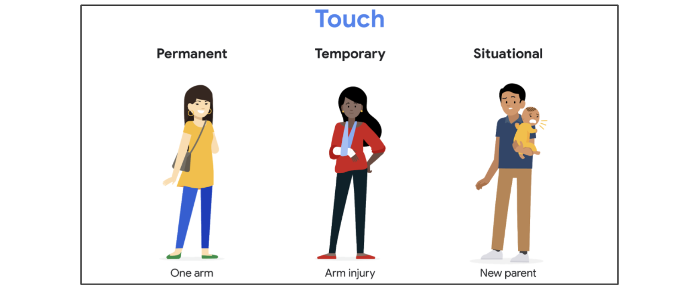
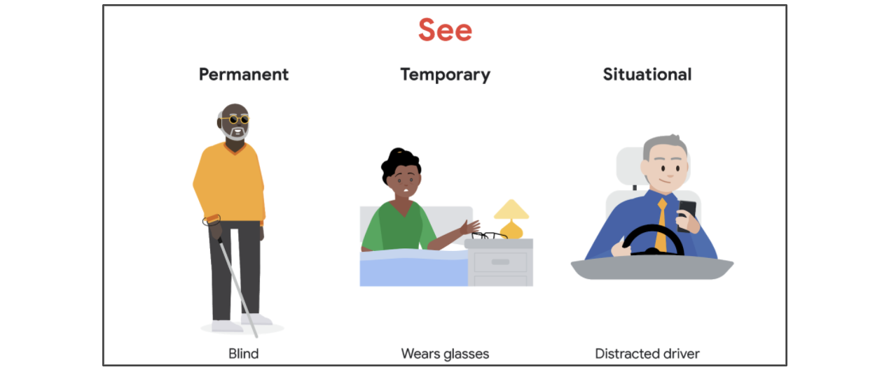
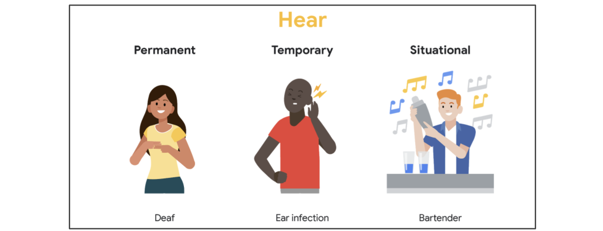
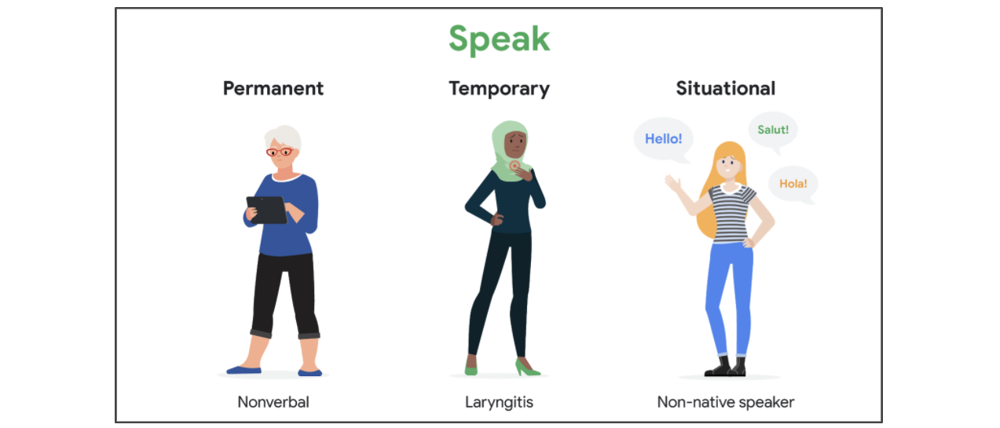

# Create a user journey map for your portfolio project

### Craft user stories
##### Learn more about user stories
###### Definition
- A **user story** is a fictional one-sentence story told from the persona’s point of view to inspire and inform design decisions. This is a great opportunity to use your imagination as you create the stories that capture the needs of your users.
###### Format
- As a type of user (who), I want to action (what) so that benefit (why).

### Create a user journey map
##### User journey map slides
###### Definition
- A user journey is the series of experiences a user has as they achieve a specific goal.
###### Example
- 

### Consider accessibility
##### Consider accessibility during user research
- Accessibility is the design of products, devices, services, or environments for people with disabilities.
- Designing for accessibility is about considering all users’ journeys, keeping their permanent, temporary, or situational disabilities in mind.
> Touch

> See

> Hear

> Speak

##### Understand the cub cut effect
- The **curb-cut effect** is a phenomenon that describes how products and policies designed for people with disabilities often end up helping everyone.

##### Create a user journey map for your portfolio project
- https://docs.google.com/presentation/d/13-RfLCAEJkiORVF8riQ2YXxz17MbfIor6yqZY-GNB2w/edit?usp=sharing
