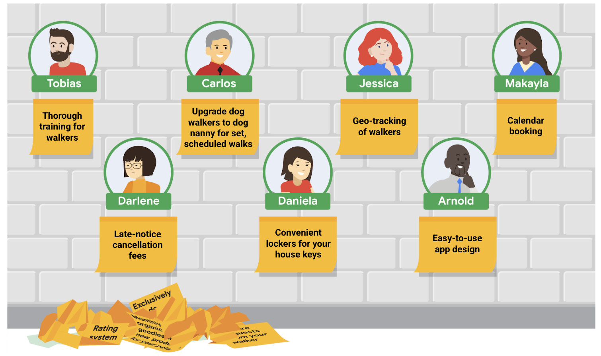

# Defining user problems

## 1. Problem Statements

: A clear description of the user's needs that should be addressed.

Strong Problem statement is...

- Human-centered
- Broad enough for creative freedom
- Narrow enough to be solved by a design


```txt
Amal is a athlete
who needs to sign up for workout classes
because the class he wants to participate in fills up fast
```

Defining Problem statements helps us

- Establish goals
  - An effective, clear, and concise problem statement tells you what **the user really needs**. So that it makes the whole design team onboard and focused on the same thing.
- Understand constraints
  - It helps us to identify what's keeping users from satisfying their needs.
- Define deliverables
  - What will we have to show for it? It helps us draw picture of what our solution will produce.
- Create benchmarks for success
  - We can define how we are going to measure our success.

## 2. The connection between pain points and problem statements

Pain points can fall into...

- **Financial**, or money-related pain points
- **Product**, which are pain points related to quality issues.
- **Process**, which are pain points related to the user's journey.
- **Support**, which are pain points related to getting help from customer service.

## 3. Problem Statement framework : 6하원칙 (5Ws and H)

The most common framework used to create problem statements is the 5 Ws and H framework. After you define the user's pain points, you can answer **who, what, when, where, why, and how** to solve the user's problem.

- Who : Know your **users** and their **background**.
- What : Which problem are we **trying to solve**?
- Where : **Where is the user** When they are using the product.
- When : When does the problem **happen**?
- Why : Why **is the problem important** to be solved?
- How : How will users **reach their goals** by using the product?

```txt
Who: A busy executive

What: Arnold wants to hire a daily dog walker for his three dogs.

Where: Arnold is likely using the app at work, on the go. 

When: Arnold gets frustrated when he opens the app, starting from the very beginning of the user journey. 

Why: Arnold doesn’t have a lot of experience with phone apps or similar technology. 

How: Arnold wants to go easily from the home screen of the app to the list of dog walkers to the confirmation screen. 
```

Then we can make the final problem statement from 5Ws and H.

=> Arnold is a busy executive who needs an easy app experience to hire a dog walker because he's not technologically savvy.

## 4. Define Hypothesis statement

: Our best educated guess on what we think the solution to a design problem might be.

Unlike problem statements, there's not a standard formula to use for writing hypothesis statements.

### If / Then formula


```txt
- If Amal downloads the gym's app
then he can reserve his favorite class in advance

- If Arnold downlaods the dog walker app, the they can utilize the "simplified" mode setting to view only the basic app functions.

- If Tobias signs up for the dog walker app, then they will quickly and easily pick a walker that fits their schedule
```

### We believe formula

```txt
- We believe that a simplified mode of the dog walker app for Arnold will allow them to hire dog walkers efficiently.

- We believe that easy access to available dog walkers for Tobias will increase the amount of walks they choose for their pets.
```

## 5. Value Proposition

By defining product's value propositions, it helps you summarize why a consumer should use a product or service.

Value propositions should be short, clear, and to the point.

### 5.1. Start with two questions

- **What does your product do?** Clearly explain the offering that your product provides users.
- **Why should the user care?** Describe how your product addresses users' pain points.

### 5.2. Describe your product's features and benefits

Just put every great feature into the list, big and small. List everything that comes in mind.


### 5.3. Explain the value of the product

The product or service should be beneficial to users. The categories can be determinded after user interviews.


There are a few features that doesn't meet any of these benefits nor add any value for users.

- Monthly organic goodies and new products for your pets
- Exclusively for dog walking (no other kinds of pets)
- Rating system for walkers
- Training tips

### 5.4. Connect these features and benefits with the needs of your users

From the user pain points, connect the features to each user.



### 5.5. Review your official value proposition list

```txt
- Thorough training for walkers
- Upgrade dog walkers to dog nanny for set, scheduled walks
- Geo-tracking of walkers 
- Calendar booking
- Late-notice cancellation fees
- Convenient lockers that hold your house keys 
- Easy-to-use app design 
```

### 5.6. Extra - Look at competitors' reviews

You will be able to define what they are good at and what they are suck at.

## [Activity] Value proposition of Photography app

1. Features and benefits

   - Easy safe-payment
   - Photographers portfolio
   - Intuitive picture showcases
   - Filter by experties
   - In-app communication
   - Service recommendation
   - Search near you

2. Explain the value of the product.

   - Accessible
     - In-app communication
     - Filter by experties

   - Professional experience
     - Photographers portfolio
     - Intuitive picture showcases

   - Reliability
     - Easy safe-payment

## 6. Understand human factors

: Describes the range of variables humans bring to their product interactions

### Common human factors that inform design

- Impatience
- Limited memory
- Needing analogies
- Limited concentration
- Changes in need
- Needing motivation
- Prejudices
- Fears
- Making errors
- Misjudgement

### Mental models

Internal maps that allow humans to predict how something will work.

If you face a door, your mental model tells you that **the door can be opened**. The process of opening the door is expected to end with you being able to leave the room.

The mental model breaks when you can't go through as you thought. Such as blocked wall.

### Feedback loops

Refer to the outcome a user gets at the end of a process

If you enter a dark room and flip a light switch, the room will either brighten, or it won't. Positive feedback would be the light coming on.

While negative feedback would be nothing happening.

The more positive feedback a user gets when completing the action, the more they will expect the outcome to be positive.

But it's the same for negative feedbacks. If your user takes an action, it's important that they get some kind of confirmation that the action worked or that it didn't.

## 7. Explore psychology principles that influence design

### Von Restorff effect (Isolation effect)

When multiple, similar objects are present, the one that differs from the rest is most likely to be remembered.


### Call-to-action (CTA)

A visual prompt that teels the user to take action


The green button tells you that you should click this to complete the search.

### Serial position effect

When people are given a list of items, they are more likely to remember the first few and the last few, while the items in the middle tend to blur.


### Hick's Law

The more options a user has the longer it takes for them to make a decision


## Resources

[Design Problem Statements: What They Are and How to Frame Them](https://www.toptal.com/designers/product-design/design-problem-statement)

[User Need Statements: The 'Define' Stage in Design Thinking](https://www.nngroup.com/articles/user-need-statements/)

[Are you solving the right problem?](https://hbr.org/2012/09/are-you-solving-the-right-problem)
