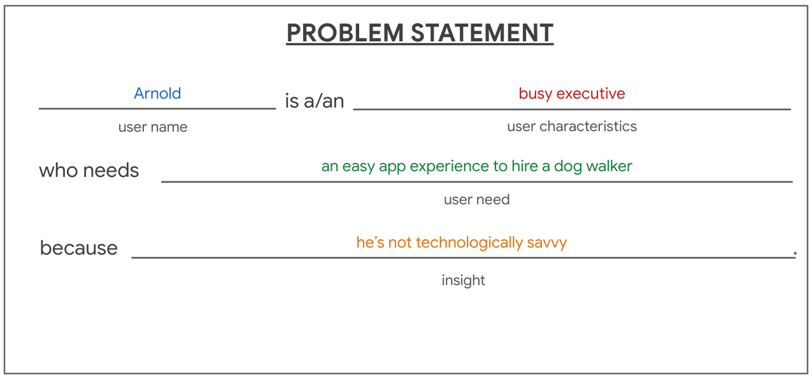
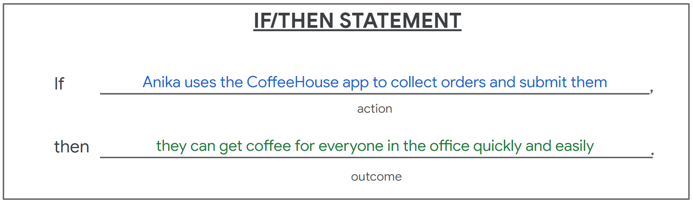

# Defining User Problems

### Define problem statements
- **Problem statements** provide a clear description of the user’s need that should be addressed. To build a problem statement, you can utilize the 5 Ws framework.
##### The 5 Ws and H: who, what, when, where, why, and how
- **Who** is experiencing the problem?
- **What** are the pain points you’re trying to solve?
- **Where** is the user when they’re using the product?
- **When** does the problem occur?
- **Why** is the problem important?
- **How** are users reaching their goals by using the product?
##### The problem statement formula

##### The impact of problem statements
- Problem statements provide clarity about your users’ goals and help UX designers identify constraints that prevent users from meeting those goals.
- Problem statements also help your team measure success.

### Define hypothesis statements
- A **hypothesis statement** is an educated guess about what you think the solution to a design problem might be.
##### The hypothesis statement formulasif
- if / then format:

- we believe format:
  - **We believe** that a simplified mode of the dog walker app **for** Arnold **will** allow them to hire dog walkers efficiently.
  - **We believe** that easy access to available dog walkers **for** Tobias **will** increase the amount of walks they choose for their pets.

### Determine a value proposition
- **Value propositions** summarize why a consumer should use a product or service.
##### Build value propositions
- **What does your product do?** Clearly explain the offering that your product provides users.
- **Why should the user care?** Describe how your product addresses users’ pain points.
1. Describe your product’s features and benefits.
2. Explain the value of the product.
3. Connect these features and benefits with the needs of your users.
4. Review your official value proposition list.

### Understand human factors
- The human factor describes the range of variables humans bring to their product interactions.

### Explore psychology principles that influence design
- It's important for UX designers to use these different psychological principles in an ethical way.
