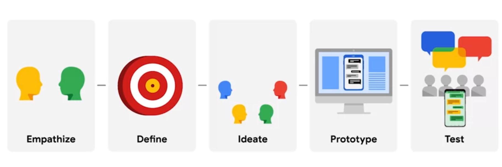
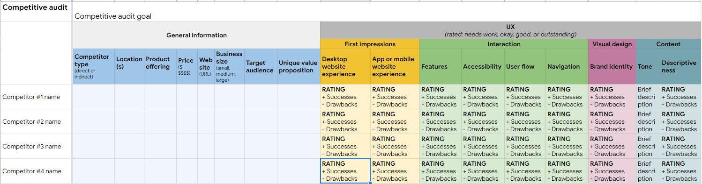
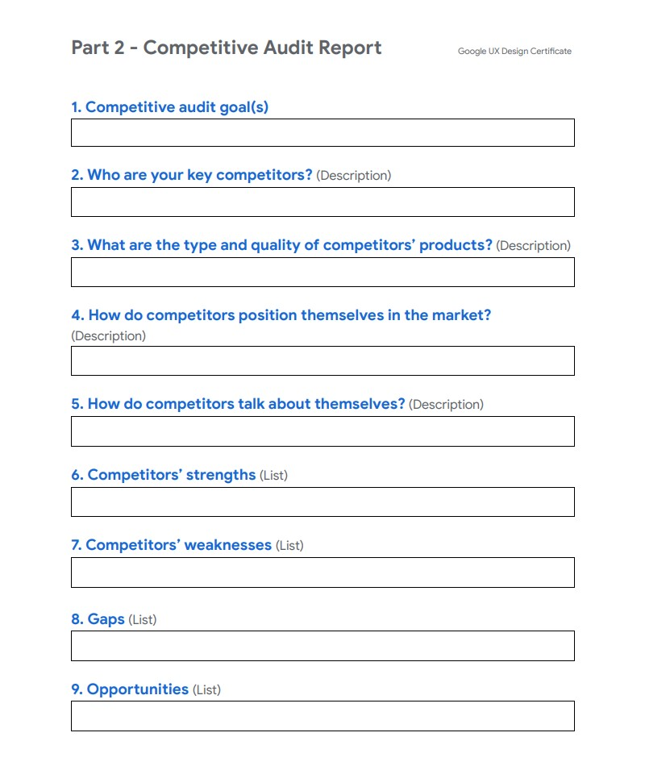

##### :heartpulse:  Two things that are super important in the UX design industry
1. Determination to succeed 
2. Desire to help others

___

## Five stages of the Design Thinking process

## Basics of UX research & design thinking process. 
1. Personas, user story, identified happy paths and edge cases, and user journey maps based on empathizing with users.
2. Defined the user problem, by creating problem statements and hypothesis statements. 
3. :point_right: Ideate through the use of competitive audits and brainstorming exercises, like "How Might We" and Crazy Eights. 

  
## Ideating-design-solutions
Ideation is all about coming up with lots and lots of ideas. (No evaluation is allowed at this stage.)
#### Preparing for ideation
- Empathize with your user. 
- Define the problem. 
- Establish a creative environment.
- Set a time limit.
- Assemble a diverse team. 
- Think outside the box. (https://careerfoundry.com/en/blog/ux-design/what-is-ideation-in-design-thinking/)

####  After you come up with a bunch of ideas, take a break. and evaluate.
 
1. Feasiblile: Is it technically possible to build? 
2. Desirable: Does it solve the user problem you're focusing on? 
3. Viable: Is it financially beneficial for the business?  https://designthinking.ideo.com/

#### IDEATION is focusd on coming up with a lot of ideas
- ideas will be narrowed down when you have to think about constraints.
- we need to come up with ideas that are equitable- works best for usrs
- Let users test the idea and they might find the best ideas.

####  Understanding the business needs behind a design
Design can help facilitate a conversation between a business and its users.
- Voice and tone have a huge impact on a user's experience with a product
- Keep in mind the fundamentals of driving sales when designing.
- it's helpful to research your brand's competitors as part of the design exploration.

  
## ideate #01. Competitive audits
<b> Direct competitors:</b> similar to your product and focus on the same audience. 
<b> Indirect competitors:</b> similar set of offerings, but focus on a different audience or vice versa. 
refs: 
[competitive analysis quide](https://www.toptal.com/product-managers/freelance/product-designer-guide-to-competitive-analysis)
[competitive analysis preparation](https://edwardlowe.org/how-to-conduct-and-prepare-a-competitive-analysis/)

###  TEMPLATES
##### [competitive audit comparison template](https://docs.google.com/spreadsheets/d/1LVg_P5m-BkbHq_bc6_chsXOjpCgHicccRrvBwnau5y0/template/preview?resourcekey=0-JvbWRktWTVmeAPI2Mx2q9Q) ( :watermelon: [example](https://docs.google.com/spreadsheets/d/1OoIrE_H-rS7girFJpopQ0CBSuM98stuBFPNa-vMP5ls/template/preview#gid=2073884517) )

##### [competitive audit report template](https://docs.google.com/document/u/3/d/1PR1TfbyJLiBaYDkDpuKY9IR6OeSMmwLGll0XhPxN0Q4/template/preview) ( :shaved_ice: [example](https://docs.google.com/document/d/1lExH--Wky12432L7lUCkd6M7JOCLU7QTrlUgrOafnCg/template/preview#heading=h.ro6simovwtk5) )

### how to use findings from your competitive audit to brainstorm new ideas?
Your goal is to walk away from this brainstorm with a list of ideas that help your product stand out from the competition.
##### Lots of ideas >  sorting > group similar ideas to uncover patterns > few ideas will naturally rise to the top

  
## Ideate #02. Brainstorm design ideas by sketching

### Design ideation _a. "How Might We?" 
Reframing the user's need as a question can help you think of your users and their needs in a new way.
 

  
### Design ideation _b. Sketching

