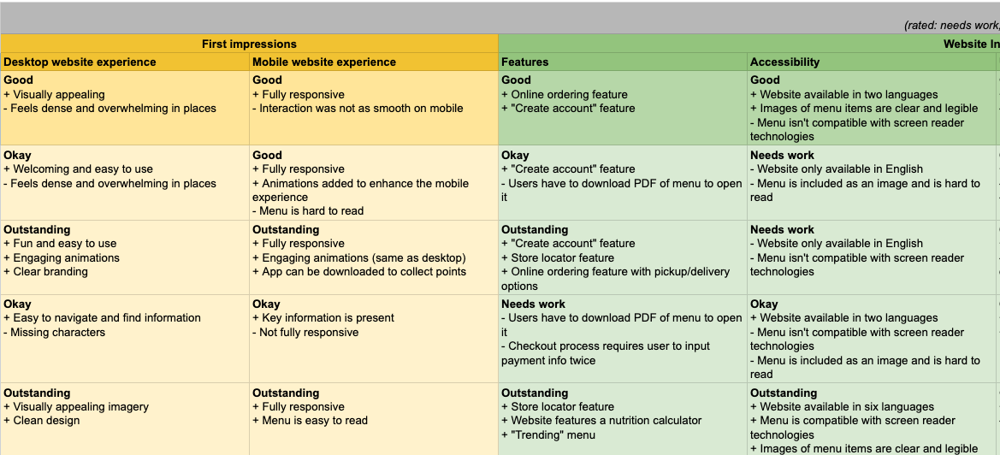
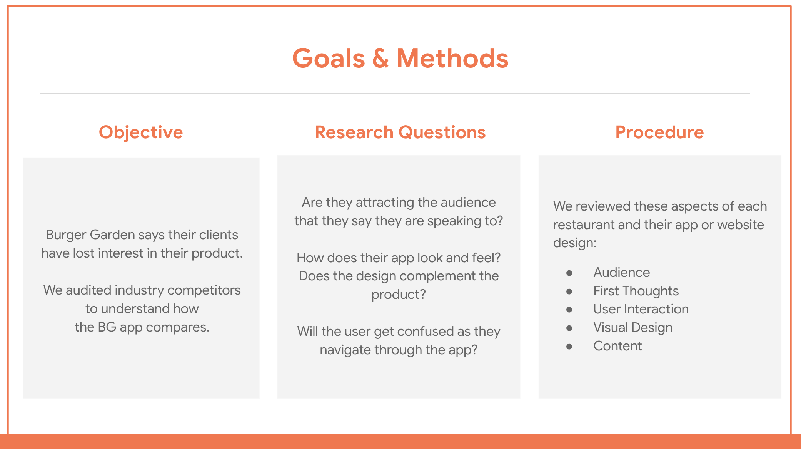
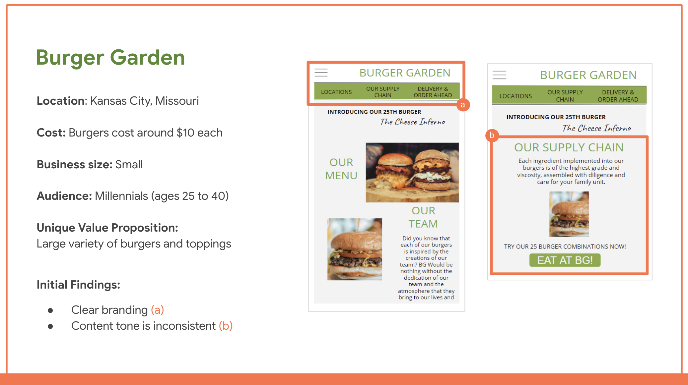

# Ideating Design solutions

## 1. Ideation

: The process of generating a broad set of ideas on a given topic, with no attempt to judge or evaluate them

### Ideation in real world

A designer, individually or in a group

- Brainstroms out loud.
- Every idea is documented (on sticky notes or a white board)
- The goal is quantity of ideas over quality
- No judge or evaluation at this stage
- Different background and perspectives
- Question the obvious.
  - It can be difficult to question a common belief or practice if everyone has the same opinions.
- After ideation, take a break and come back later to evaluate all together

### Evaluating ideas

You really should have a reason why you are pushing the idea

- Feasible
  - Is it technically possible to build?
- Desirable
  - Does it solve the user problem you're focusing on?
- Viable
  - Is it financially beneficial for the business?

The ideas meeting these three criteria could be a good option to choose.

## 2. Understand business needs behind a design

### Two major components of branding are voice and the tone

- Branding has a big effect on how users experience a product
- Users want to interact with the brand whose voice and tone sounds human and engaging
  - For example, Users would prefer "Happy for your new journey" tone order confirmation email over Cold Order confirmation email.
- Design can help facilitate a conversation between a business and its users.

### Budget is important as well

- The design should drive sales that benefits both the customer and the business

### Research your brand's competitors as part of the design exploration

- Knowing the successes and failures of your competition can help influence your design decisions

## 3. Competitive audit

: An overview of your competitors' strengths and weaknesses

Competitive audit is just one tool to explore ideas for designs

### What can you learn from Competitive audit?

- Identifying your key competitors
- Reviewing the products that your competitors offer
- Understanding how your competitors position themselves in the market
- Examining what your competition does well and what they could do better
- Considering how your competitors talk about themselves

### Direct Competitors

: Have offerings that are similar to your product and focus on the same audience

### Indirect Competitors

: Have a similar set of offerings but focus on a different audience, or have a different set of offerings and focus on the same audience.

### Benefits to competitive audits

- Inform your design process
  - How did your competitors approach designing their products?
- Solve usability problems
  - e.g. Is the competitor's website difficult to use?
- Reveal gaps in the market
  - Are there user needs that your competitors do not meet?
- Provide reliable evidence
  - It helps you to have a deep understanding of business needs and market gaps

### Limitation of competitive audits

- Stifle(suffocating) creativity
  - If you spend too much time focusing on what they are doing, you might prevent yourself from creating a truly innovative product.
  - The competitive audits should give you only starting point and let you push forward and innovate.
- Depends on how well you interpret the findings
- Not all designs work in all use cases
  - Even though a competitor has a feature, it might not needed for our product
- Need to be done regularly
  - You want to stay on top of what your competitors are doing and keep an eye out for new competitors that might emerge.

## 4. Conduct Competitive audit

1. Outline the goals for the competitive audit
   - Make sure the goals are specific. It will be helpful to break down the different product aspects you want to compare.

   - For example, a goal for the e-commerce website competitive audit can be "Shopping experience". Then it can be broken down into "Customer reviews", "Ratings", "Return policy", "Delivery", etc.

   * e.g. Goal: Compare the user experience of each competitor's website

2. Create a spreadsheet with a list of your competitors [Sample](https://docs.google.com/spreadsheets/d/161VBzpqjfF1X9hjp9E5TlbLXOuFrBS4KQsrQke8SZlk/template/preview),  [Template](https://docs.google.com/spreadsheets/d/1LVg_P5m-BkbHq_bc6_chsXOjpCgHicccRrvBwnau5y0/template/preview?resourcekey=0-JvbWRktWTVmeAPI2Mx2q9Q)
   - Aim to include 5-10 competitors, both direct and indirect competitors.

   

   Using consistent language for rating competitor products can also create more uniform feedback and help you "grade" and "process" competitors.

   - **Needs work**: The app is not usable, and users aren’t getting what they need from this aspect of the app.

   - **Okay**: This aspect has some issues, but with some work, it could meet user needs.

   - **Good**: This aspect works well, but doesn’t always provide users with the necessary information easily.

   - **Outstanding**: This aspect feels consistent, and it meets or exceeds the user’s needs.

3. Call out the specific aspects you want to compare
   - The list of aspects should align to your goals for the audit.

   - Check out each of the competitors’ websites and rate them based on the following categories:  

      - **First impressions**: Check out the website on both desktop and mobile devices, and make note of your first impressions. Is the website responsive, meaning that it resizes across devices? Does the design complement the product? How do you feel about the website?

      - **Interaction**: Explore the user flow and navigation of the website. What features are available for users? Is the website accessible to all users, including those using screen readers? How inclusive is their website to non-English speakers? Will the user get confused as they click through the website pages, or is the navigation clear?

      - **Visual design**: Review competitor branding and their overall consistency. Does the website appear and feel the same throughout all sections and pages? Does the branding match the intended audience? Is the imagery and color palette memorable?

      - **Content**: Examine the written content included on the website. Does the tone of the content match the company’s branding? Will users be able to find the details they’re interested in?

4. Research each company
   - Depends on the audit goal, what you include in the report and how you present your findings will vary.

     - e.g. If your audit mainly focuses on comparing competitors’ audiences, you might want to include a few informational graphics with numbers and figures.
     - e.g. If your audit mainly focuses on visual design, you might want to include screenshots of your competitors’ websites with different areas highlighted.

5. Analyze findings

6. Summarize findings in a report [Report template](https://docs.google.com/document/d/1PR1TfbyJLiBaYDkDpuKY9IR6OeSMmwLGll0XhPxN0Q4/template/preview)

7. Present your findings

## 5. How Might We Phrase

- Amp up the good
  - Think of how you might use any positives in the problem as a solution
  - e.g. How might we make keeping track of tickets a fun competition among friends?
- Explore the opposite
  - Think of how you'd solve the opposite of the problem you've outlined.
  - e.g. How might we create a way to lose tickets?
- Change a status quo
  - Think of ways to completely change the process.
  - e.g. How might we make a non-paper concert ticket?
- Break the point-of-view into pieces
  - This is especially helpful for long, complex problems
  - e.g. How might we keep the customer's ticket from getting lost? how might we make a lost ticket easier for the security team to handle?
- Remove the bad
  - Think of how to remove the negative part of the problem entirely.
  - e.g. How might we make a way for concert goers to enter a venue without needing a ticket?
- Go after the adjective
  - Take any negative adjectives and try to turn them into positives.
  - e.g. How might we make the entry to a concert venue less stressful for ticket holders?
- Question an assumption
  - Remove or change anyh processes that you assume have to be in place
  - e.g. How mihgt we remove the security check process at a concert?
- Create an analogy using the established need or context
  - Think of ways to compare this user experience to another experience.
  - e.g. How might we make going through security like playing a video game?
- Identify unexpected resources that can provide assistance
  - Think of how the problem might be solved by a resource that isn't mentioned in the problem statement.
  - e.g. How might facial recognition softwrae help manage concert entry?

## 6. Crazy Eights

One of many possible ways to ideate.

- Sketch eight different designs, each with a new idea for solving the user's problem.
- Do it only in 8 minutes! each design gets one minute to draw

### Best practice

- Start with a creative warm-up exercise
- Make sure the problem is well defined with "Problem statement"
- Don't judge yours or others ideas

## Resources

[What is Ideation in Design Thinkin?](https://careerfoundry.com/en/blog/ux-design/what-is-ideation-in-design-thinking/)

[Design Thinking Defined](https://designthinking.ideo.com/)

[A Product Designer’s Guide to Competitive Analysis](https://www.toptal.com/product-managers/freelance/product-designer-guide-to-competitive-analysis)

[How to Conduct and Prepare a Competitive Analysis](https://edwardlowe.org/how-to-conduct-and-prepare-a-competitive-analysis/)

[20 World-Class Presentation Experts Share Their Top Tips](https://www.forbes.com/sites/markfidelman/2014/08/15/20-world-class-presentation-experts-share-their-top-tips/?sh=6ae9a1945c40)

[Stanford's How Might We Question](https://static1.squarespace.com/static/57c6b79629687fde090a0fdd/t/589cc8b8d2b85721b37d3efe/1486670008488/HMW-Worksheet.pdf)

[Crazy Concept Ideation with Crazy 8s](https://www.switchit.com/blog/design/crazy-concept-ideation-with-crazy-8s.aspx)