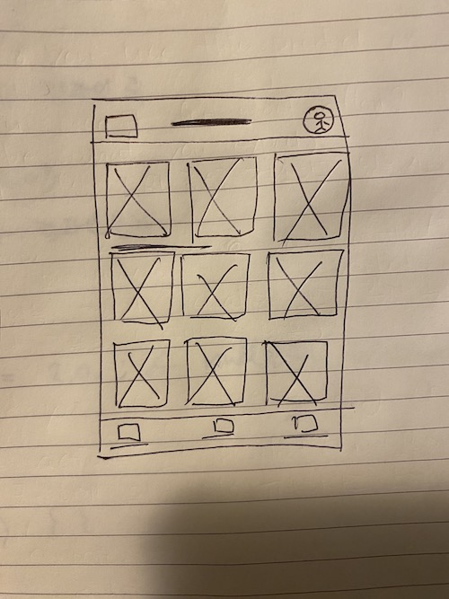

# Storyboarding and Wireframing

## Rewind...

- **Empathy maps** explore users’ four main motivations: what the user says, thinks, does, and feels. The insights gathered from empathy maps help you come up with ideas for solutions that address the user’s real problems.

- P**ersonas** place the users who you’re designing for front-and-center. By creating detailed user profiles, you can clearly envision potential users that you’d design for.

- **User stories** determine which user needs are the most critical to address with your designs. This direction will help focus your ideation.

- **User journeys** help you come up with ideas for designs that truly support the users’ needs and solve their problems.

- A **problem statement** is a clear description of the user’s need that should be addressed. The problem statement you created in the last course will guide the focus of your ideation.

## 1. Goal Statement

From the problem statements we defined, fill the Goal statement using 4 subjects.

- **What** the product lets users do
- **Who** the action affects
- **Why** the action positively affects users
- **How** the effectiveness of the product is measured

It is a transition from the problem that the users are facing to a solution that meets their needs.

From the problem statement we defined

We can find
- Product (WHAT), perform specific action (WHAT)
- Describe who the action will affect (WHO)
- Describe how the action will positively affect users (WHY)
- Describe how you will measure the impact (HOW)

## 2. User Flow

- **Action** : What users will interact with the product design (button or anything)
- **Screen** : A page or what users will experience while completing tasks
- **Decision** : Where users must ask a question and make a decision
- **Flow Direction** : Branches that made by decisions

You don't have to come up with every possible scenarios in the product, but you should ensure that the user flow your create focusses on the needs that the majority of users will face.

## 3. Storyboard

: A series of panels or frames that visually describe and explore a user's experience with a product

It's more like a drawing version of User Journey map

### Four elements of a storyboard

- Character : The user in the story

- Scene : Helps us imagine the user's environment or background

- Plot : The benefit or solution of the design

- Narrative : The user's need or problem and how the design will solve the problem

### Big Picture Storyboards

: Focuses on the user experience

Think about how poeple will use the product throughtout their day and why that product will be useful.

- What is the pain point that user will encounter?

### Close-up storyboards

: Focuses on the details within the product instead of on the user experiencing that product.

While big-picture storyboards focus on the how and the why, close-up storyboards focus on the what.

- What happens on each screen of the product?
- What does the user do to transition from one screen to another?
- What are potential problems with the flow?

The close-up story board is less about emotion, since we're not focused on the user but product itself.

### What to choose?

It depends on the stage of your design process. If you are early in design process, Big-picture storyboard will help you to present high-level ideas to stakeholders.

Close-up storyboards are more useful when the initial design directions have been explored. It will help you to think about practical ideas about improving the product.

Or sometimes, we can take both approaches into account.

## 4. Filling up Big Picture Storyboards

** Keep in mind that Big picture storyboard focuses on User Experience

1. Prepare the problem statement and the goal statement you want to address
2. Begin filling out the storyboard template by adding the scenario
   - Write a sentence that sets the narrative for the storyboard. Write a short, clear sentence that describes the user and the problem your design solves for them.
3. Draw one idea per panel
   - Each panel should demonstrate an action and an emotion like using emojis.
   > In the first panel, what is the event that triggers Dan to find a new drummer? In this case, Dan’s drummer quit, so he needs to find a replacement drummer to join the band.

   > In the second panel, Dan finds and opens an app that can help him recruit qualified, new, or substitute musicians that are located in his local area. This action should be drawn in its own panel.

   > In the third panel, Dan finds an experienced drummer who lives nearby while scrolling through the app. He filters for drummers with at least five years of experience in a professional band, who have good reviews, and who live within 30 miles of his current location.

4. Expose pain points for the user along their journey
   - The panel should describe user's fear, pain point, bad experience, so that it leads the reasoning panel after.
   > Dan had a bad experience in the past when he hired a keyboard player for the band who turned out to be unqualified. While using this new app, Dan needs to be able to identify qualifications from the musician’s profile, like how many years they’ve played in a band or the ratings they’ve received from other users. Dan might feel a little nervous because of his past bad experiences finding bandmates. This is drawn in the fourth panel.

5. Include the user goal or conclusion in the final panel
    - Does user feel happy? Make sure to include an emotion to demonstrate how the user feels at the end of the experience with the project.
    > a new drummer joins the band. Dan is very happy, and his band schedules several gigs. Dan feels excited and satisfied. 

## 5. Filling up Close-up Storyboards

The prep is as same as Big picture storyboard

1. Start with a problem statement
2. Create a goal statement
3. Set up the storyboard
4. Add the storyboard scenario

5. Draw one idea per panel
   - But in the close-up storyboard, each panel focus on the product workflow. Each panel should show the product details you want to draw attention and the reason of that.
   - You want to demonstrate the user flow within the product and how each action within the product will lead to the next screen.
   > To begin, in the first panel, the user will open their phone, swipe through their apps, and tap the icon for the musician app to open it.

   > Oftentimes when designing an app, one panel of a close-up storyboard will focus on how a user begins their journey when they first open the app. For this example of the app to find musicians, let’s imagine that a new user can create a profile or an existing user can log in. This is shown in the second panel.

   > In the third panel, once the user is logged into the app, they can begin searching for their bandmate. The user scrolls through profiles of musicians and can set filters like level of experience, years played, location, instruments played, and more.

   > In the fourth panel, the user taps the “view profile” button of one of the musicians to review their experience, qualifications, and location.

   > Then, once the user finds a candidate they’re interested in contacting, they tap the “submit” button to send a message to that musician. The user can write their own message or send an automated message that asks about availability and to schedule a conversation. There’s also an option for the user to provide a sample of their music to the musician. This is shown in the fifth panel.

   > Finally, in the sixth panel, the user receives a confirmation that their message has been sent and a description of the next steps to expect. The text below the confirmation might say something like, “Your message to this musician has been sent.” There will also be a button linking back to the user’s inbox and one that leads them back to the search page they just came from.

## 6. Fidelity

: How closely a design matches the look-and-feel of the final product

### Low Fidelity

- Lower amount of complexity
- Less refined or polished
- Called "Lo-fi" for short

Use low fidelity designs when we want to get ideas out quickly and leave room for exploration

### High Fidelity

- Closely matches the look and feel of the final product
- More refined or polished
- Called "Hi-fi" for short

Use high fidelity designs when we want to test a design that looks like a real product and get more specific feedback from users.

Minecraft (Low fidelity) <-> Unreal Engine (High fidelity)

## 7. Wireframe

: A basic outline of a digital experience, like an app or website

It is one kind of low-fidelity design. And they look like they were created with wires, mostly formed with lines and shapes with some text.

1. Establishes the basic structure of a page before any visual components like color or images
    - How do I organize information on the page in a way that makes sense for users?

2. Highlights the intended function of the product
    - You should think about how the elements serve the overall functionality.
    - eg. the function of a button should be clear, and that functionality is expressed through the way that it's drawn.

3. Helps designers save time and resources
    - Allows the team to quickly try out different design options.
    - Serves as a guide for everyone involved in the project.

** Good wireframe is all about organizing and communicating information clearly to your colleagues who will implement your design.

### Elements

: Building blocks for creating a design. Like lines, shapes (squares or circles), and text.

### Industry standards

: Common ways to indicate page elements

1. Text - Represented by horizontal lines

2. Images, Photos, Illustrations, and Icons - Represented by a circle and an **X** overlapping each circle

3. Calls to Action - Represented by rectangles or circles

### Practice

Google Photo wireframe

### Benefits of wireframining

- Inform the elements to include in your actual design
  - Seeing the elements laid out on a page will help everyone decide if the right elements are included

- Help you catch problems early
  - Allow you to map out how all the elements will look on each page and how users will navigate from page to page.
  - Let you check if elements are missing, out of order, or disorganized.

- Get stakeholders to focus on structure without visual interruption

- Save time and effort
  - Serve as a guide for everyone involved in the project.
  - Engineers and other stakeholders agree to follow the guide early, so fewer revisions are needed.

- Let you iterate quickly

## 8. Practice : Draw a wireframe of a faviorite app

1. Select a mobile app to wireframe
   - Think of a mobile app you enjoy using, and navigate to the app’s home screen. If the home screen has common UI components, such as menus and buttons, it’s a good selection for practicing your wireframe drawing skills. 
2. Write a list of key home screen info
   - Before you start drawing, write a short list of the key information that is on the app’s home screen. Your list might include a navigation menu, a search bar, images, text, and other elements that are important to using the app. This will help you plan which elements need to be drawn in your paper wireframe and how they should be drawn.
3. Draw the home screen’s frame
   - Using a piece of paper and a pen or pencil, draw a rectangle to represent the frame of the app’s home screen. The dimensions don’t need to be exact. It’s only important that the home screen’s key elements can fit in the rectangle and be placed similar to how they appear on the screen.
4. Draw the screen’s key elements
   - Draw the key elements of the app’s home screen from Step 2 as lines and simple shapes—like circles, squares, and rectangles—within the frame. Follow the industry standards explained in the course video for representing certain elements:

        - Body text is represented by horizontal lines. (Short labels and headings can be written out.)

        - Images, photos, illustrations, and icons are represented by squares with large Xs drawn on top of them. (Simple shapes, like menu icons, can be drawn as they appear.)

        - Calls to action—like “submit” or “compose” buttons—are represented by rectangles or circles, whichever fits the basic shape the element has on the screen.

    Industry standards help you make sure your wireframes are simple and understandable, especially for any collaborators.
5. Reflect on the completion of this activity
   - Does your paper wireframe:
        - Fit all of the key elements of the home page in the home screen frame?
        - Reflect all of the key elements of your chosen app’s home page?
        - Follow industry standards for representing various elements?

