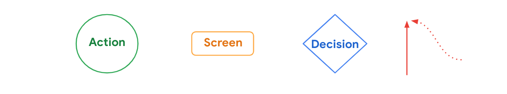
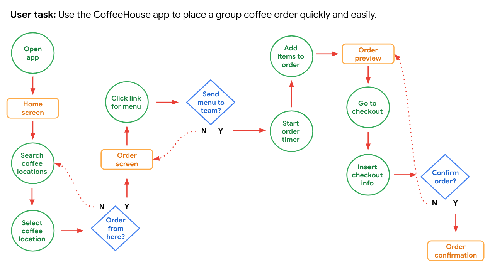

# StoryBoarding and Wireframing

### Build goal statements
- A **goal statement** is one or two sentences that describe a product and its benefits for the user.

### Outline a user flow

- Action: The actions users take when moving through a product design are represented as circles.
- Screen: The screens of a digital product that users will experience while completing tasks are represented as rectangles.
- Decision: Diamonds represent points in the user flow where users must ask a question and make a decision.
- User flow direction: Lines with arrows tie everything together and display the flow of information.

### Create storyboards
- In UX design, a **storyboard** is a series of panels or frames that visually describes and explores a user’s experience with a product.
- The four key elements of a storyboard are:
  - Character: States the user in the storyboard.
  - Scene: Gives designers a way to imagine the user’s environment.
  - Plot: Describes the solution or benefit offered by the design.
  - Narrative: Describes the problem the user is facing and how the design will solve this problem.
##### Big picture storyboards
- Big picture storyboards focus on the **user**.
- Notice that this big picture storyboard is focused on the how and the why behind the user’s engagement with your design.

##### Close-up storyboards
- Close-up storyboards focus on the **product**.
- Close-up storyboards focus on the what.

### Get started with wireframes

##### Assesment
- Body text is represented by horizontal lines. (Short labels and headings are written out.)
- Images, photos, illustrations, and icons are represented by squares with large Xs drawn on top of them. (Simple shapes, like menu icons, can be drawn as they appear.)
- Calls to action—like “submit” or “compose” buttons—are represented by rectangles or circles, whichever fits the basic shape the element has on the screen.

##### Benefits of wireframes
- Inform the elements to include in your design
- Catch problems early
- Get stakeholders to focus on structure
- Save time and effort
- Iterate quickly
