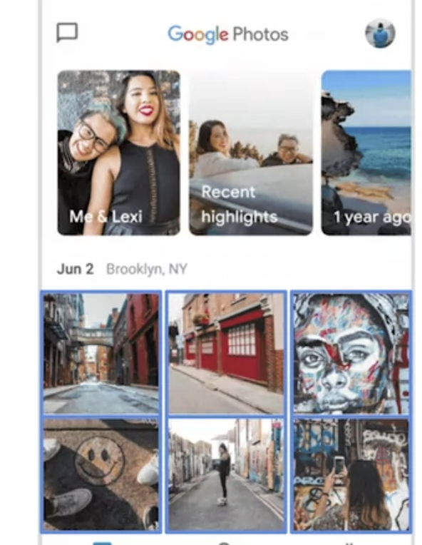

# Creating paper and digital wireframe

## 1. IA or Information Architecture

: Organizes content to help users understand where they are in a product and where the information they want is.

If users find a product easy to use, it means they can find what they are looking for, quickly and intuitively.

It means that how we organize the information is very important to make it easy to use.

IA should be informed by many sources, like user research and the ways that existing products in the market are structured.

### Importance of information architecture

- Organizes and defines the overall structure for the app or site
- Provides a high-level view of a product
  - You need to understand how the elements of a product fit together and relate to each other in order to create the design of the product
- Helps stakeholders review your designs
  - IA will help the information to be organized. If they are placed in the appropriate places, they will help accomplishing business or product goals
- Helps engineers understand how to organize the data
- Allows your ideas to grow and iterate with the design

### How the IA is formed

1. Organization
   - How different pieces of information correct in a product.
2. Hierarchy
   - Tree structure that each information has placed along with in a certain category
3. Sequence
   - Enables users to move through an app via certain orders or steps

### Eight Basic Princicples of IA

[Eight Basic Principles by Dan Brown](https://eightshapes.com/dan-brown/)

1. **Object principle:** You should view your content as “living” and as something that changes and grows over time.

2. **Choice principle:** People think they want to have many choices, but they actually need fewer choices that are well-organized.

3. **Disclosure principle:** Information should not be unexpected or unnecessary.

4. **Exemplar principle:** Humans put things into categories and group different concepts together.

5. **Front door principle:** People will usually arrive at a homepage from another website.

6. **Multiple classification principle:** People have different ways of searching for information.

7. **Focused navigation principle:** There must be a strategy and logic behind the way navigation menus are designed.

8. **Growth principle:** The amount of content in a design will grow over time.

## 2. Paper Wireframe

A wireframe is a basic outline of a digital experience, like an app or website, that's made up of lines and simple shapes.

By drawing a wireframe is to establish the basic structure of a page and to highlight the intended function of each element.

Paper wireframe is a most fastest way to draw wireframe as a mock up.

- It's very fast
- Inexpensive. Just need a pen and paper
- Explore lots of ideas since it is fast and inexpensive
- Narrow our focus

### Procedure

1. Before we start drawing, write a quick list of the information that needs to be covered on the page. So that you don't miss any important information to go.

2. Start drawing. It's a good rule of thumb to try to create at least 5 different versions of how you wnat to structure information on a page. We are trying to explore lots of ideas at this phase so better create more as much as possible.

3. Review your wireframes. And then, put stars on ideas or features on the pages which you like the most.

## 3. Digital Wireframe

### Am I ready to move toward to digital wireframes?

1. Is my paper  wireframe complete?
    - At least you should have an idea of the structure that you wnat to use in the wireframe.
2. Have I received feedback on my paper wireframe?
3. Am I ready to consider basic visual cues?
    - Color and images don't come into play until much later.

### Transitioning to digital wireframes

1. Use actual content for important pieces of text, instead of all placeholder text
2. Hold back on adding expressive content such as color or images
      - The wireframe should still focus on functionality, not visual.

### Benefits of digital wireframes

- Pay more attention to the details
  - The goal of paper wireframe was to get all of ideas out on paper.
  - But now with digital wireframes, it's important to get the structure right.
- Easier to share with colleagues

## 4. Gestalt Principles

: How humans group similar elements, recognize patterns, and simplify complex images when we perceive objects

Use the principles to organize content on apps and websites so that it's visually pleasing and easier to understand.

* Humans natually notice the whole of something before noticing the parts.

e.g) If you look at the clouds and try to find shapes within them, you would likely spot a cloud that loosely resembled an animal or a familiar object.

- Similarity
  - Elements that look similar are perceived to have the same function. Look similar based on their shape, size, or color.
  - e.g) Links in the webpage is blue. They help us to think that the blue with underlined text will be an URL.
  => Making elements that have a similar function, look similar to give the app a more intuitive user experience.

- Proximity
  - Elements that are close together appear to be more related than things that are spaced farther apart.
  => Place elements that are related close together instead of far apart.

- Common Region
  - Elements located within the same area are perceived to be grouped together
  => Use borders in the wireframes to group elements together.

## References

[Information Architecture. Basics for Designers.](https://uxplanet.org/information-architecture-basics-for-designers-b5d43df62e20)

[The Beginner’s Guide to Information Architecture in UX](https://xd.adobe.com/ideas/process/information-architecture/information-ux-architect/)

[An Excellent Beginner’s Guide to Information Architecture](https://careerfoundry.com/en/blog/ux-design/a-beginners-guide-to-information-architecture/)

[5 Examples of Effective Information Architecture](https:/~/xd.adobe.com/ideas/process/information-architecture/information-architecture-examples/)

[Designing The Information Architecture (IA) of Mobile Apps](https://applikeysolutions.com/blog/designing-the-information-architecture-ia-of-mobile-apps)

[Accessibility: Guidelines for Information Architecture, UX Design, and Visual Design](https://medium.com/design-ibm/accessibility-guidelines-for-information-architecture-ux-design-and-visual-design-5ae33ed1d52d)

[World IA Day 2019 — accessibility tips for Information Architects](https://people4research.medium.com/world-ia-day-2019-accessibility-tips-for-information-architects-79bd187191a4)

[Information architecture: a UX designer’s guide](https://www.justinmind.com/wireframe/information-architecture-ux-guide)