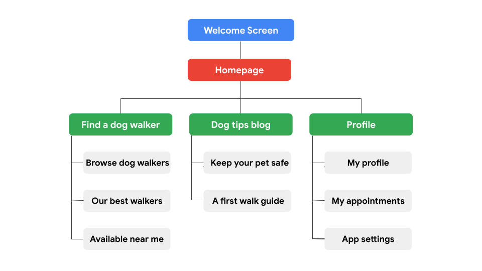

# Creating Paper and Digital Wireframe

### Understanding information architecture

- Organizes content to help users understand where they are in a product and where the information they want is.
##### Information architecture is made up of three pieces:
1. Organization
2. infHierarchy
3. Sequence
##### Importance of information architecture
- Organizes and defines the overall structure for the app or site
- Provides a high-level view of a product
- Helps stakeholders review your designs
- Helps engineers understand how to organize the data
- Allows your ideas to grow and iterate with the design

### Create paper wireframes

##### Benefits of paper wireframes
- Fast
- Inexpensive
- Explore lots of ideas
- Narrow our focus
##### The completed process for a single wireframe
1. Gather materials
2. Write a list of the elements you need to include in your wireframe
3. Create five different versions of how to structure information on the page
4. Choose which elements to refine
5. Combine elements into a refined wireframe

### Create digital wireframes

##### Moving from paper to digital wireframes
- Is my paper wireframe complete?
- Have I received feedback on my paper wireframe?
- Am I ready to consider basic visual cues?
##### Transitioning to digital wireframes
- Use actual content for important pieces of text
- Hold back on adding expressive content
##### Benefits of digital wireframes
- Pay more attention to the details
- Easier to share

### Use Gestalt Principles in wireframes
- How humans group similar elements, recognize patterns, and simplify complex images when we perceive objects

- **Similarity** means that elements that look alike (in shape, size, or color, for instance) are perceived to have the same function.

- **Proximity** means that elements that are close together appear to be more related than things that are spaced farther apart.

- **Common region**ss means that elements located within the same closed area are perceived to be grouped together.
