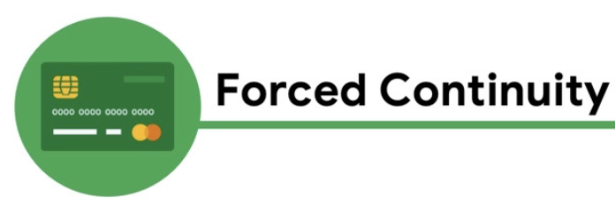
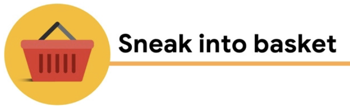
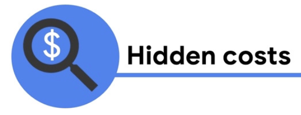
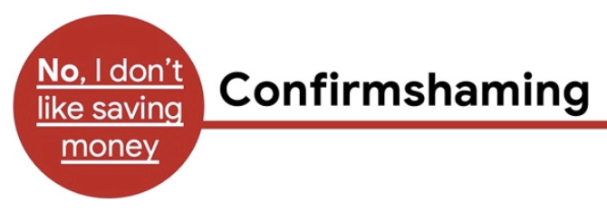
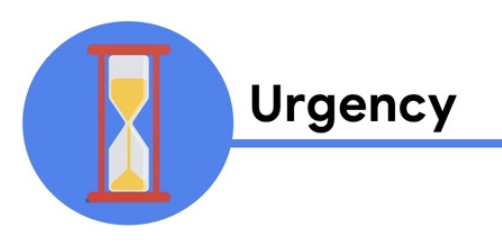

# Building Low fidelity prototypes

## 1. What is Prototype

: An early model of a product that demonstrates functionality

### Fidelity

: How closely a design matches the look-and-feel of the final product

### Low fidelity (Lo-fi) Prototype

: A simple, **interactive** model that provides a **basic idea** of what the product would look like

The goal of lo-fi prototype is to make the design **testable** so that we can collect and analyze **feedback** early on.

=> Lo-fi prototype is for **early stage testing and feedback iteration** before we jump into hi-fi prototype.

## 2. Paper Prototype

Why Paper prototype?

1. Inexpensive
   - Timely or costly, you just need pen and paper with lots of drawing
2. Rapid Iteration
   - Since you can draw any screen real fast, you can whip up paper prototypes for lots of different ideas quickly
3. Low commitment
   - Since Paper prototype is inexpensive, it is very quick and doesn't burn so badly if they should be trashed. Meanwhile, digital wireframe requires lots of work and commitment to make it interactive.
4. Encourage honest feedback from colleagues
   - Since they are less polished, people tend to feel more comfortable criticizing them.
5. Collaborative activity
   - Each person can draw their own page's prototype and lots of ideas and feedbacks can be shared.

But it has drawbacks as well

1. Hard to interpret
   - Since Paper Prototype is less polished, it requires imagination of final product for users while testing it.
   - Imagine a list of recipes without any images.
2. Tested in person
   - It cannot be conducted without a person who can actually draw the prototype in real time
   - Because of the similar problem, it cannot be tested as a remote team.

Paper Prototype is only one of the ways to create a testable material for stakeholders.

If the platform is well established, it can be done in an actual program or website. Or you can even skip the paper prototype if you feel comfortable with digital prototype. It really depends on which stage you are at and under what circumstances you can work.

## 3. Digital prototype

Try everything in Figma!

## 4. Inclusive Design

### Implicit biases

: The collection of attitudes and stereotypes we associate with people without our conscious knowledge

Whether positive or negative, these biases can unconsciousely be mistaken for truth when in reality they aren't.

## 5. Deceptive patterns

: UX methods that trick users into doing or buying something they wouldn't otherwise have done or bought

These can include a range of visual, interactive, audio, or motion elements added to e-commerce sites, ads, and other marketing content.

It is so as called `dark pattern`.

As a clear point, Deceptive Patterns are ethically wrong and not a good business practice even though they seem like they help making more money in a way.

It often (most of time) leads losing respect and trust for a company's brand. And also it can be a snowball of the business's future.

1. Forced continuity
   - The practice of charging a user for membership **without a warning or a reminder**
    - e.g.) after a 7-days of trial, it auto charges without warning or notification.
2. Sneak into basket
   - Put extra things into the cart without letting users know.
   - e.g.) Hotel reservation with hidden insurance item checked.
3. Hidden costs
   - Similar to `Sneak into basket`, there are extra charges in the cart instead of extra products.
   - e.g.) Website advertise free shpping but then charges for handling
4. Confirmshaming
   - When users are made to feel guilty when they opt out of something.
   - e.g.) When the website asks you to subscribe to their newsletter, the option says "sign me up", and "No thanks", instead of straighforward "yes".
   - e.g.) `No, I like paying full price`, `No, I don't care about the environment enough to subscribe to this newsletter`.
5. Urgency
   - Convince you that you need to purchase an item before you run out of time or miss today's amazing price.
6. Scarcity
   - Makes you very aware of the limited number of items in stock.
   - e.g.) `26 people have this lamp in their cart`, `Hurry, only done more box of cereal like this left`

### Why people use deceptive pattern?

Primary reason of it is **money**. Using deceptive pattern to manipulate or trick people into

- using a product
- subscribing to a service
- sharing personal information

### How to fix them?

#### 1. Forced Continuity

- Notify users before their free trial ends and before they are charged.

- Make it easy for users to cancel their membership. Don’t make users search for the steps to cancel.

- Provide a link to take users through the cancellation process.

- Make sure the visual elements in your designs, like buttons, are labeled clearly.

#### 2. Sneak into basket

- Make sure **no boxes are pre-selected** that add items to a user's cart.

#### 3. Hidden costs

- Be sure to give users all pricing related information upfront.

- Make a calculator available during shopping where the user can calculate extra costs, like shipping and taxes, before checking out.

#### 4. Confirmshaming

- Think carefully about the words you are using on buttons and confirmation screens to avoid manipulating the emotions of your users.

#### 5. Urgency

Urgency is not just about offers and deals that are limited. It's about adding increased pressure on the user to commit to a purchase quickly.

- Think about how you are utilizing urgency and ensure you aren't using this deceptive pattern to manipulate your users into making sales quickly.

#### 6. Scarcity

- Think about what user's need to know about a purchase that they are going to make if scarcity is being used to urge them to commit to an impulse purchase or if it is meant to inform users of the availability of a product.

## Readings

**Inclusive Design**

[How well do IBM, Microsoft, and Face++ AI services guess the gender of a face?](http://gendershades.org/)

[Fair Is Not the Default - Why building inclusive tech takes more than good intentions](https://design.google/library/fair-not-default/)

[Discrimination by Design - The many ways design decisions treat people unequally.](https://www.propublica.org/article/discrimination-by-design)

[Podcast - Benjamin Evans: The power of inclusive design](https://www.designbetter.co/podcast/benjamin-evans)

[How to design and manage equity-focused evaluations](https://evalpartners.org/sites/default/files/EWP5_Equity_focused_evaluations.pdf)

**Attention Economy**

[NNG - The Attention Economy](https://www.nngroup.com/articles/attention-economy/)

[Berkeley Economic Review - Paying Attention: The Attention Economy](https://econreview.berkeley.edu/paying-attention-the-attention-economy/)

**Ethical Design**

[Ethics in user experience design from Usability Geek](https://usabilitygeek.com/ethics-in-user-experience-design/)

[The good, the bad, and the ugly in user experience design from User Experience Magazine](https://uxpamagazine.org/building-an-ethics-framework-for-ux-design/) 

[10 principles for ethical UX design from UX Collective ](https://uxdesign.cc/10-principles-for-ethical-ux-designs-21faf5ab243d)