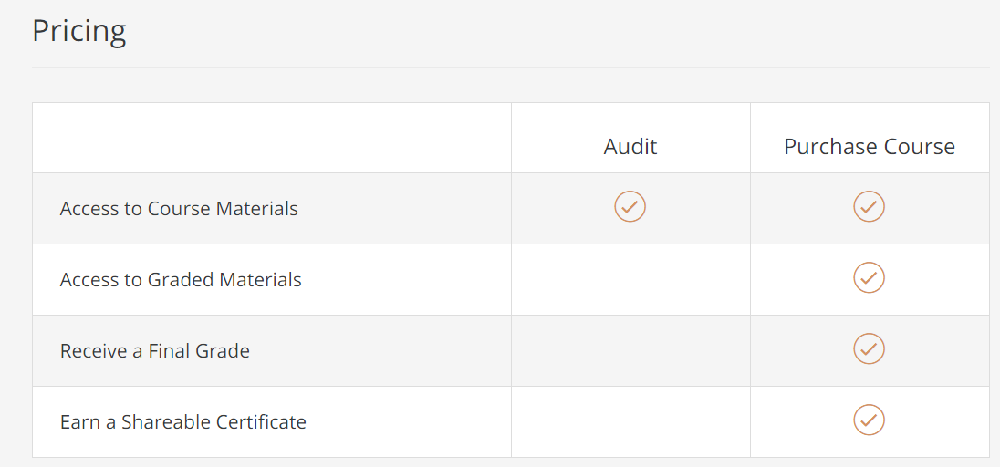

# UX Design Study 01 - Foundations of User Experience Design

UX 디자인 스터디에 참여해주신 모든 분들을 환영합니다!

## 이 스터디는...

제가 스터디 그룹의 첫 뼈대로 잡았던 방향은 Udemy에 있는 온라인 강의를 들으면서 간략하게 공부를 하고 각자 가지고 있는 아이디어를 가지고 배웠던 이론등을 적용해보는 방법이었는데요, 다른 디자이너 친구들, UX 디자이너 분들에게 조언을 구한 뒤 Google의 Coursera 강의로 진행하는 것을 최종 목표로 잡았습니다. 

스터디의 첫 발자국은 제가 밟았지만 참여해주신 모든 분들의 것이며 저는 한 명의 스터디원일 뿐입니다. 어떠한 의견이 있으시던 편하게 공유해주시고 성공적인 스터디가 될 수 있도록 다같이 힘써주셨으면 해요!

## 같이 지키도록 해요

1. 발표와 스터디 노트 작성 일정을 잘 지켜주세요. 스터디 그룹으로 공부하는 가장 큰 목적은 같은 목표를 가지고 움직이는 분들이 있다는 것이며, 이러한 주간 목표를 통해 4주차 마지막까지 공부할 수 있는 원동력이 되어줍니다.

2. 각자 개개인의 전문 분야, 실력차, 경험은 모두 다른 것이기에 서로 알려주고 많이 배워갈 수 있는 스터디가 되었으면 좋겠습니다.
 
## 논의 사항

Certificate의 전체 과정은 6개월 가량의 정말 긴 기간이며 7개 강의 모두 최소 20-30시간 분량의 제법 난이도가 있는 선택입니다. 참여해 주시는 모든 스터디원 분들이 끝까지 함께 하실 수 있도록 저또한 노력하겠지만 현실적으로는 어렵다고 생각하고 있어요. 7개나 되는만큼 중간에 subcourse를 참여하지 않으시더라도 그 이후 과정에 다시 참여하시거나 새로 시작하셔도 충분히 괜찮습니다. 저희 근데 혼자서는 끝까지 완주 못할거 같아서 스터디 참여한거 아니었나요...? 😉

대단원의 첫번째인 Foundations of User Experience는 원론적인 얘기를 많이 하고 있어서 사실 서로 공유할 내용이 많이 없을 수도 있고, 스터디 그룹의 진행이 조금 어색할수도 있어요. 어떤 방식으로 스터디가 진행이 되면 좋을지에 대하여 피드백이 있으시다면 언제든지 환영합니다.

2차 강의가 총 28시간, 4주짜리이긴 한데 아무리 바로 시작하더라도 11월 30일부터 12월 21일 또는 28일에 종료가 가능합니다. 12월이 연말이기도 하고 여행 가실 분들도 제법 있을 수 있으니 먼저 의견을 좀 들어보고 2차 스터디를 언제부터 시작할지 정해보겠습니다. 제 생각인데, 1차와 2차 사이에 간격이 너무 길어지면 스터디 폭파 당할거 같아요 😥

## Audit 신청하는 법

Coursera의 좋은 점은 양질의 강의를 무료로 들을 수 있다는 점입니다. 청강을 하더라도 다 듣고 난 뒤에 돈을 내서 Certificate을 받을 수 있습니다. 

확인한 바로는 위 사진에 나와있는 *Graded Material*은 실제 학위와 연관이 있는 거라서 저희가 들으려는 강의와는 상관이 없고, 각 강의 주차에 있는 Weekly Challenge를 보면  *Purchase to unlock이라고* 써있긴 하지만 access가 가능했습니다. 만약 Weekly Challenge access에 차후 문제가 생기면 이 부분을 스터디에서 다룰지는 다시 논의해 보겠습니다.

 

Course 링크를 따라 들어가시면 위처럼 버튼이 있고 그 아래에

**Audit** the course 버튼이 있습니다.

## 스터디의 향후 방향

위에 제가 언급했듯이 최종 목표는 마지막 7번째 강의까지 모두 완주하는 것입니다. 가능하다면요!

헌데 UX Cousera Certification 코스 내용들을 잘 보시면 실습 중심보다는 이론을 적절히 분배한 내용이라서 중간에 Figma를 사용하기는 하지만 계속 이론 중심의 스터디를 하기에는 조금 지루해지는 순간이 오지 않을까 하는 생각을 하고 있어요.

그래서 Figma로 실습하는 강의를 병행해서 듣고 실습과 디자인 프로세스도 같이 진행해보는 방법은 어떠한지 의견을 여쭤보고 싶습니다.

Cousera에 있는 짧은 무료강의들이에요.

[Get Started with Figma](https://www.coursera.org/projects/get-started-figma)

[Designing a Low Fidelity Prototype in Figma](https://www.coursera.org/projects/designing-a-low-fidelity-prototype-in-figma)

Udemy에 있는 유료 강의들도 있습니다.

[The Complete Figma Course](https://www.udemy.com/course/the-complete-figma-course/)

인프런에도 괜찮은 강의들이 있었어요!

[뉴욕 프로덕트 디자이너가 알려주는, 입문자를 위한 UX디자인 개론](https://www.inflearn.com/course/ux%EB%94%94%EC%9E%90%EC%9D%B8-%EC%9E%85%EB%AC%B8#curriculum)

[피그마(Figma)를 활용한 UI디자인 입문부터 실전까지 A to Z](https://www.inflearn.com/course/%ED%94%BC%EA%B7%B8%EB%A7%88-ui%EB%94%94%EC%9E%90%EC%9D%B8)